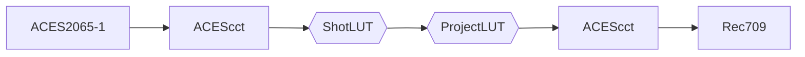
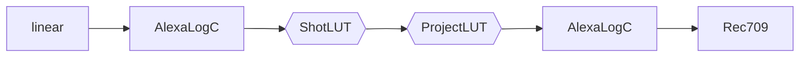

#### Info

- Name: Full Project Name
- ShotGrid: [ShotGrid - NAME](https://automatik-vfx.shotgunstudio.com/page/project_overview?project_id=ID)
- Location: `LONDON`|`BERLIN` `/mnt/projects/NAME`

#### Creation Tasks

- [x] Create ShotGrid project
- [ ] Create file system folder via AMI
- [ ] Create OCIO setup
- [ ] Create Delivery Packager setup
- [ ] Deploy OCIO and Delivery Packager configs studio-wide

#### Archiving Tasks

- [ ] Create plate and comp ProRes movies
- [ ] Create folder structure and copy Nuke scripts
- [ ] Archive on ShotGrid

#### Color setup
Base config.ocio: **ACES**|**linear**

